# Hi, I'm Firdavs  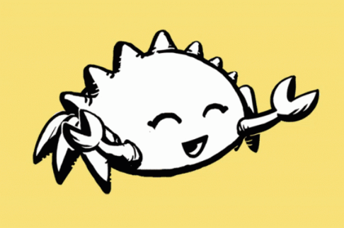

###  Developer | Cybersecurity Enthusiast | Designer

I'm a developer focused on building practical software, learning backend engineering, and exploring cybersecurity.

I enjoy turning ideas into working products and continuously improving my technical skills.

---

##  What I Work With

### Backend & Programming

* 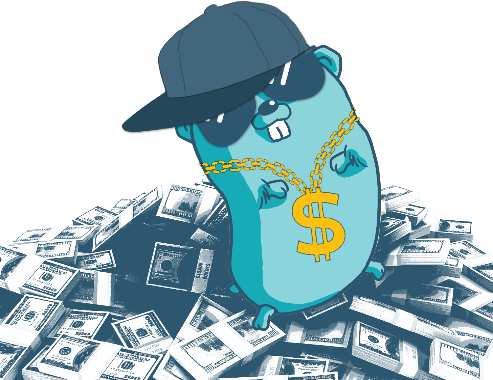
* 

### Frontend

* 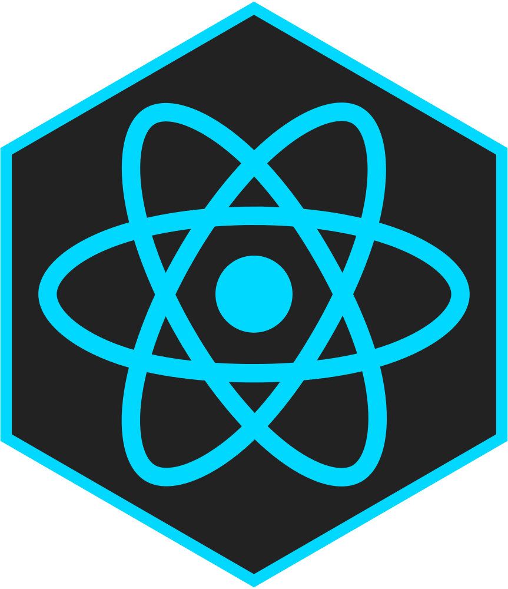 
*  
* 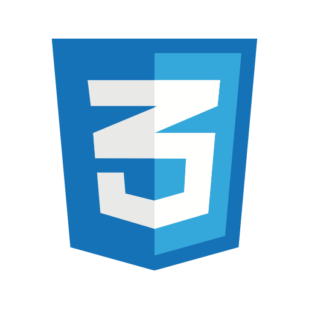 

### Cybersecurity

* 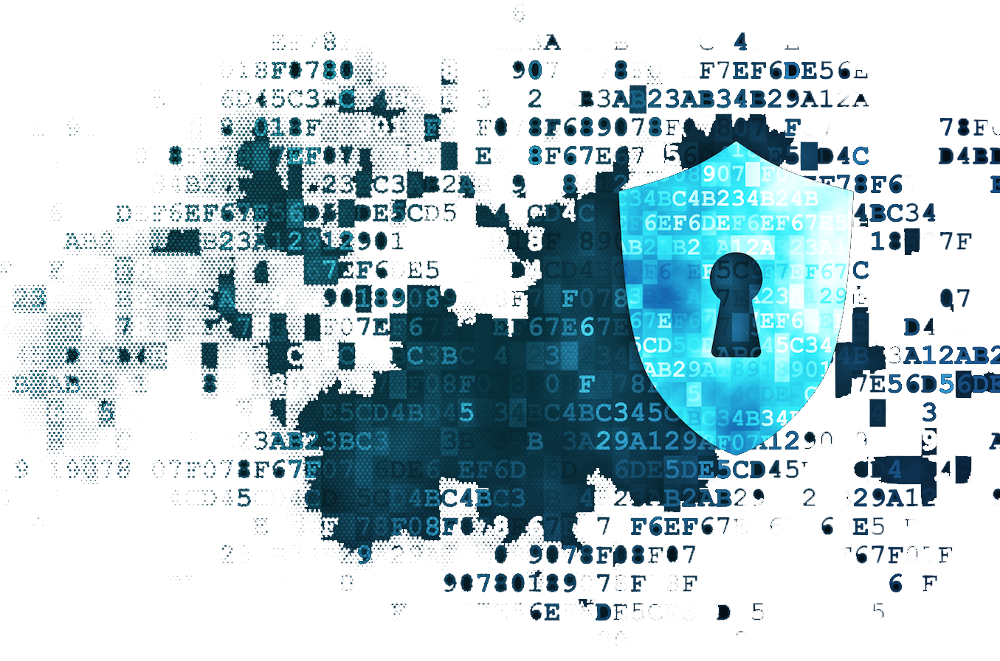 Cybersecurity fundamentals
* 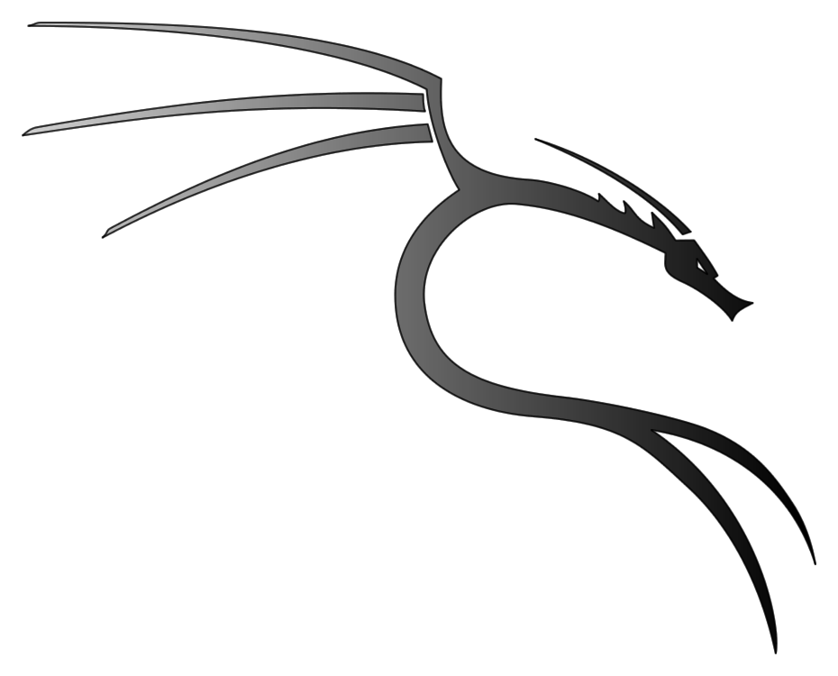 Security & system exploration

### Operating Systems
*  **My device**
* 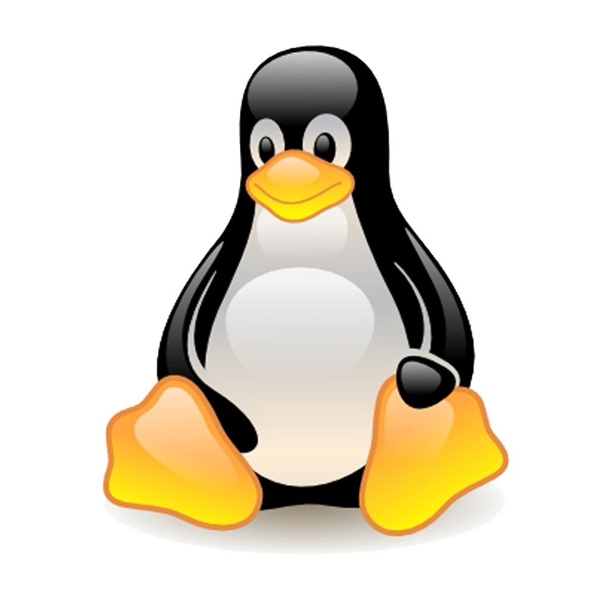 **Linux**
*  **Fedora**

### Design

* 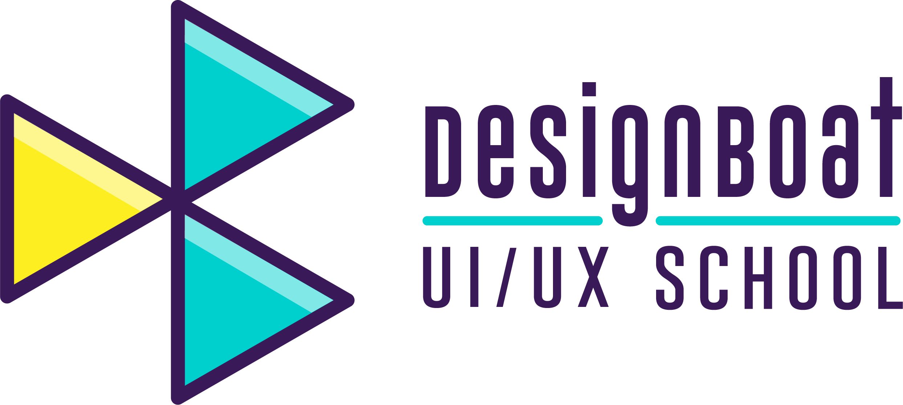
* 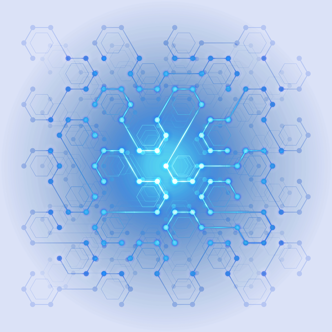 
*  

---

##   Currently Focused On

* Deepening my **Go** knowledge
* Building **backend applications**
* Learning **PostgreSQL & databases**
* Developing **REST APIs**
* Understanding **concurrency & system design**
* Improving my **cybersecurity** skills
* Building real-world projects

---

## 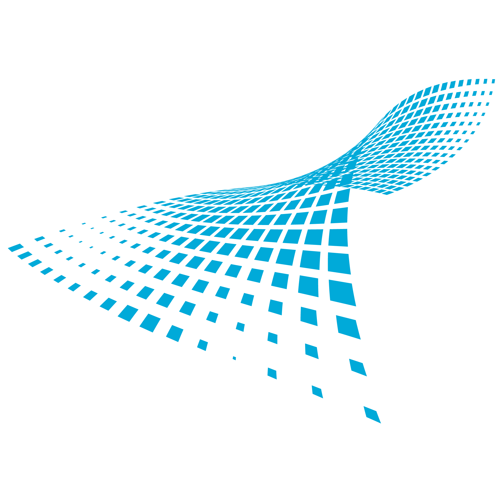  Technologies

```text
Go          █████████░
JavaScript  ████████░░
React       ███████░░░
HTML/CSS    █████████░
Linux       █████████░
Fedora      █████████░
Cybersecurity ███████░░░
Design      ████████░░
```

---

## 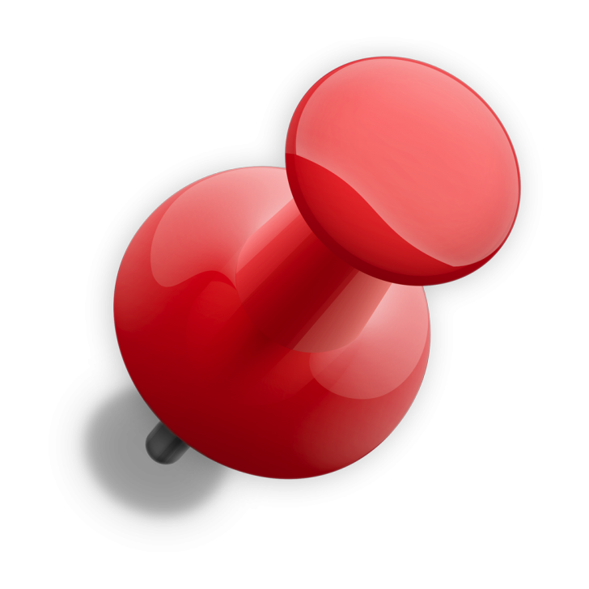 What You'll Find Here

This profile contains my:

*  Personal projects
* 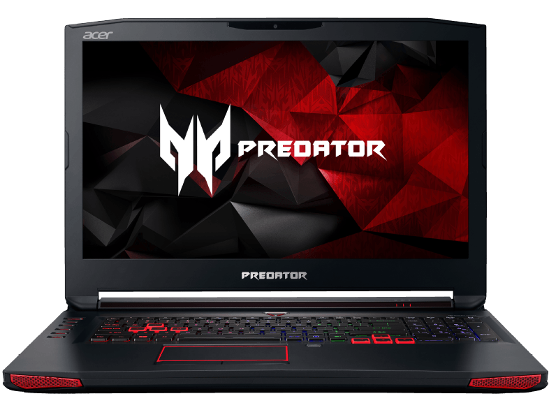 Backend experiments
*  Web applications
*  Cybersecurity projects
*  Learning experiments
*   Design work

---

##  My Goal

> **Become a strong software engineer capable of building secure, scalable, and reliable systems.**

I'm currently focused on improving through **consistent learning, real projects, and hands-on problem solving.**

---

##  Let's Connect

I'm always open to learning, collaborating, and working on interesting projects.

**Keep learning. Keep building.  **
